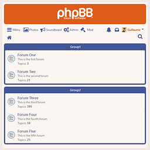

# Revereor phpBB Theme
by ltGuillaume: [Codeberg](https://codeberg.org/ltguillaume) | [GitHub](https://github.com/ltguillaume) | [Buy me a beer](https://buymeacoff.ee/ltguillaume) 🍺

A modern and clean reinterpretation of prosilver

- Automatic dark mode based on device settings, or forced light/dark mode
- Color variables to easily create your own flavor
- An improved responsive design for easy use on touch devices
- Rounded softer borders, contrast only where functional for easier reading and a less cluttered look
- No more retro gradients
- Moves the poster's profile to the left hand side, like in phpBBv2
- Changed fonts and sizes for improved compatibility and readability on modern displays